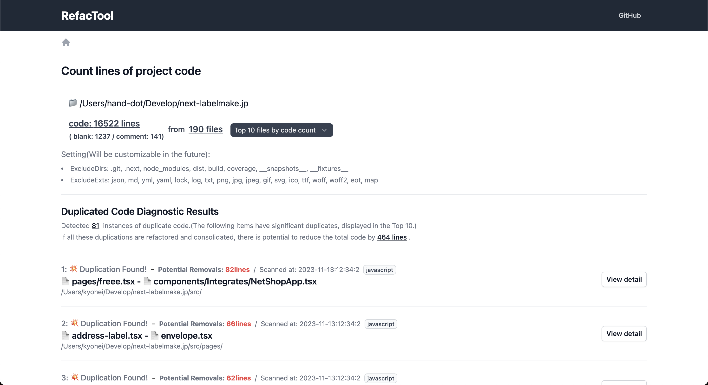
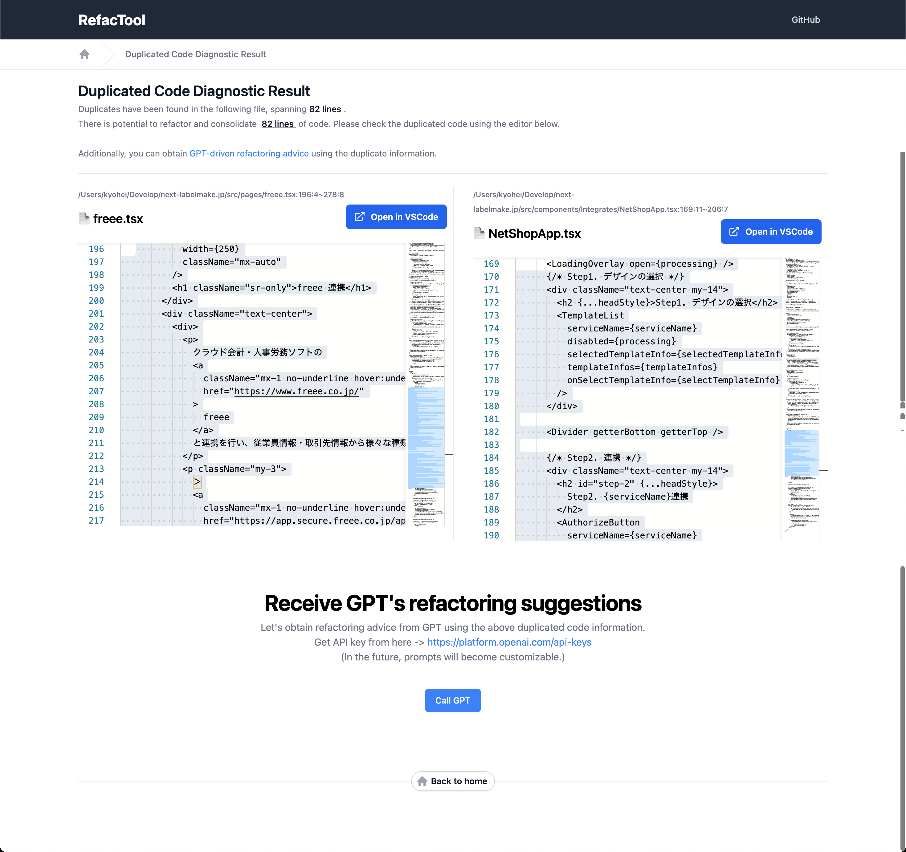

# RefTool



```bash
npx reftool
```

---

## What is this?

This tool provides essential information for understanding the total volume of a codebase, detecting duplicate code, and conducting efficient refactoring.   
By setting up an OpenAI token, it can offer refactoring advice based on the diagnosed code data.



RefTool combines various refactoring tools into a user-friendly package, saving you the hassle of remembering different instructions for each tool.

It can be easily launched using npx, ensuring a hassle-free experience.

In the future, it is planned to include features like dead code detection and evaluation of code readability.

### How to Use?

Start it from the command line:

```bash
npx reftool
```

You can also specify a project path:

```bash
npx reftool ./path/to/project
```

Or check two projects for duplicate code:

```bash
npx reftool ./path/to/project1 ./path/to/project2
```

Tip: If the detection doesn’t complete, try specifying the source code directory.
Maybe you have a lot of files in your project that aren’t source code.

```bash
npx reftool ./src
```

### How It Works?

RefTool uses tools like [cloc](https://github.com/kdridi/node-cloc) and [jscpd](https://github.com/kucherenko/jscpd). It runs a local server to monitor and analyze files.  
 Future plans include integrating more tools like [ts-prune](https://github.com/nadeesha/ts-prune). Suggestions for other tools are appreciated.

---

<details>
  <summary>TODO</summary>

  - [x] モック画面の作成
  - [x] とりあえず static な path でいいから jscpd を実行して値をパースして一覧画面に飛ばす
    - パース結果はメモリに保持しておく
  - [x] 一覧画面でそれを受け取り、リスト表示する
  - [x] 詳細画面に遷移する
    - 遷移時にメモリに保持しておいたパース結果を ID or index でサーチして渡す
  - [x] ChatGPT をコールしてマークダウンとして表示する
  - [x] diff を表示する -> 一旦できたが使いずらいのでモナコを使う
  - [x] 節約できるコードのポテンシャルは重複コードの行数とイコールで良い（アバウトで OK）
    - 一覧画面上ではポテンシャルセーブで並び替えするべき
  - [x] cloc と組み合わせると良さそう
    - 全体を把握するのに役に立つ
    - プロジェクト全体の行数と重複コードの行数を比較すると良さそう
    - 増えた減ったが後から追えると見える化ができて良さそう
  - [x] 複数(2 つ)の調査対象に対応する
  - [x] watch で指定しているディレクトリが更新されたら診断を再実行する
  - [x] 初期のローディング画面
  - [x] npx で起動してローカルでサーバーが立ち上がる(インストール不要)
  - [x] Open AI のトークンを設定できるようにする(ローカルストレージ)、ストリームできるようにする
  - [x] How it works、How to use の説明を README に書く
  - [ ] beta リリース
  - [ ] FIXME を直す
  - [ ] カスタマイズ
    - jscpd のオプションをカスタマイズできるよにする
    - ChatGPT のプロンプトをカスタマイズできるようにする
  - [ ] ts-prune を使う
  - cloc をスナップショットを撮れるようにする？
    - https://tailwindui.com/components/application-ui/data-display/stats#component-72704cac437a06d94cdb941c274591ba
    - 過去と比較してどのくらい減ったか表示したい
</details>
